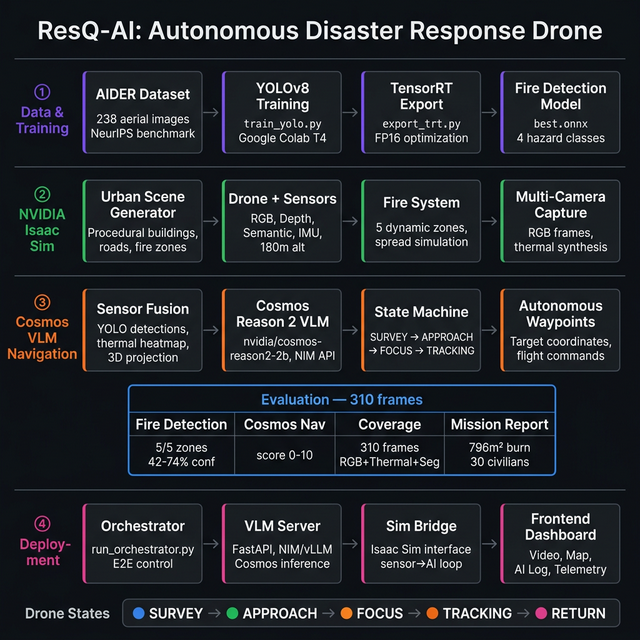

# 🚁 ResQ-AI: Autonomous Disaster Response Drone

<p align="center">
  <strong>AI-powered drone for real-time hazard detection, autonomous navigation, and situational awareness in disaster zones</strong>
</p>

<p align="center">
  
  
  
  
</p>

---

## 🌟 Overview

**ResQ-AI** is an autonomous disaster response system that deploys a simulated drone in NVIDIA Isaac Sim to survey disaster-affected urban environments. The drone uses:

- **YOLOv8** for real-time fire and hazard detection
- **NVIDIA Cosmos Reason 2** (Vision-Language Model) for autonomous flight decisions and navigation
- **Thermal imaging** for heat signature analysis
- **3D semantic segmentation** for structural assessment

The system follows a **SURVEY → INVESTIGATE → RETURN** state machine, autonomously prioritizing fire zones, tracking civilians, and generating mission reports — all without human intervention.

---

## 🏗️ System Architecture

> **ResQ-AI** end-to-end pipeline. AIDER aerial imagery trains the YOLOv8 fire detector, which feeds into an NVIDIA Isaac Sim urban disaster simulation. NVIDIA Cosmos Reason 2 VLM processes fused sensor data to autonomously navigate the drone. Results are streamed to a real-time tactical dashboard.

<p align="center">
  
</p>

<p align="center"><em>Figure 1. ResQ-AI system architecture. Aerial disaster imagery trains the YOLOv8 detector, deployed in NVIDIA Isaac Sim with Cosmos Reason 2 VLM for autonomous drone navigation and real-time fire zone prioritization.</em></p>

---

## 🎯 Key Features

| Feature | Description |
|---------|-------------|
| **🔥 Fire Detection** | YOLOv8 detects fires with bounding boxes, confidence scores, and 3D world-coordinate projection |
| **🧠 AI Navigation** | Cosmos Reason 2 VLM analyzes the scene and generates autonomous waypoints based on fire priority scoring |
| **🌡️ Thermal Imaging** | Synthetic thermal camera renders heat maps to identify fire intensity and spread |
| **📊 Mission Reports** | Auto-generated JSON reports with fire zones, civilian status, urgency levels, and recommended actions |
| **🗺️ Tactical Dashboard** | Real-time web UI with video feeds, AI reasoning log, telemetry, and fire situation display |
| **👥 Civilian Tracking** | Monitors civilian positions relative to fire zones and tracks safe/danger status |

---

## 📂 Repository Structure

```
ResQ-AI/
├── orchestrator/              # AI decision-making & VLM integration
│   ├── main.py                # Orchestrator entry point
│   ├── vlm_server.py          # Cosmos VLM server (NIM / vLLM / mock backends)
│   ├── orchestrator_bridge.py # Bridge between sim and orchestrator
│   ├── logic_gates.py         # Decision logic and state transitions
│   └── generate_map.py        # Hazard map generation
│
├── sim_bridge/                # Isaac Sim simulation interface
│   ├── headless_e2e_test.py   # Full end-to-end simulation pipeline
│   ├── yolo_detector.py       # Dual YOLO fire & person detection
│   ├── cosmos_navigator.py    # Cosmos VLM navigation controller
│   ├── drone_controller.py    # Drone flight controller
│   ├── fire_system.py         # Fire spawning & spread simulation
│   ├── spawn_drone.py         # Drone setup with sensors (RGB, Depth, Semantic, IMU)
│   ├── generate_urban_scene.py# Procedural urban scene generation
│   ├── thermal_processor.py   # Synthetic thermal image processing
│   ├── thermal_sim.py         # Thermal simulation engine
│   ├── civilian_tracker.py    # Civilian position & status tracking
│   ├── projection_utils.py    # 2D→3D coordinate projection
│   ├── report_generator.py    # Mission report generation
│   ├── render_aerial_view.py  # Aerial view rendering
│   ├── api_server.py          # REST API for dashboard
│   └── demo_flight.py         # Demo flight path controller
│
├── frontend/                  # Web dashboard UI
│   ├── index.html             # Mission Control dashboard
│   ├── page3.html             # Aerial Fire Detection view
│   └── page4.html             # Full Mission Dashboard
│
├── Phase1_SituationalAwareness/   # YOLO training & inference
│   ├── train_yolo.py          # YOLOv8 training script
│   ├── export_trt.py          # TensorRT export
│   ├── live_inference.py      # Real-time inference
│   └── run_on_colab.ipynb     # Google Colab training notebook
│
├── Phase2_StructuralSegmentation/ # Semantic segmentation
│   ├── rescuenet_download.py  # RescueNet dataset downloader
│   ├── live_inference_seg.py  # Segmentation inference
│   └── run_phase2_colab.ipynb # Colab/Kaggle notebook
│
├── Phase3_Reasoning/          # VLM reasoning setup
│   ├── setup_cosmos.py        # Cosmos model setup
│   └── requirements.txt       # Phase 3 dependencies
│
├── scripts/                   # Shell scripts
│   ├── run_demo.sh            # Launch demo
│   ├── run_e2e_test.sh        # Run full E2E test
│   └── run_headless.sh        # Headless simulation
│
├── run_orchestrator.py        # Main orchestrator launcher
├── run_cosmos_pipeline.py     # Cosmos VLM pipeline
├── generate_flight_data.py    # Flight data generation
├── render_aerial_fires.py     # Aerial fire rendering
├── Dockerfile                 # Docker container setup
├── docker-compose.yml         # Multi-service Docker config
├── requirements.txt           # Python dependencies
├── setup_isaac_sim.sh         # Isaac Sim installation script
├── setup_brev.py              # Brev cloud instance setup
└── resqai_urban_disaster.usda # 3D urban disaster scene (USD)
```

---

## 🚀 Getting Started

### Prerequisites

- **NVIDIA Isaac Sim 5.1** (requires NVIDIA GPU with RTX)
- **Python 3.10+**
- **NVIDIA API Key** (for Cosmos VLM via NIM)

# ResQ-AI Asset Dependencies

Download these packs from https://docs.omniverse.nvidia.com/usd/latest/usd_content_samples/downloadable_packs.html
and unzip them into this folder:

1. **Rigged Characters Asset Pack** (891 MB) → `assets/Characters/`
2. **Extensions Sample Asset Pack** (159 MB) → `assets/Particles/`
3. **Base Materials Pack** (8.2 GB) → `assets/BaseMaterials/`
4. **Environments Skies Pack** (8.9 GB) → `assets/Environments/`
5. **AEC Demo Assets Pack** (2.0 GB) → `assets/Architecture/`
```

### 2. Configure Environment

Create a `.env` file in the project root:

```env
NVIDIA_API_KEY=your_nvidia_api_key_here
VLM_BACKEND=nim           # Options: nim, vllm, mock
RESQAI_COSMOS_MODEL=nvidia/cosmos-reason2-2b
RESQAI_VLLM_URL=http://localhost:8000
```

### 3. Run the Full Simulation

```bash
# Run the end-to-end simulation pipeline
bash scripts/run_e2e_test.sh

# Or run directly
python sim_bridge/headless_e2e_test.py
```

### 4. Launch the Dashboard

```bash
# Serve the frontend
cd /path/to/ResQ-AI
python3 -m http.server 8080

# Open in browser
# http://localhost:8080/frontend/page3.html  — Aerial Fire Detection
# http://localhost:8080/frontend/page4.html  — Full Mission Dashboard
```

### 5. Docker (Alternative)

```bash
docker-compose up --build
```

---

## 🧠 How It Works

### 1. Scene Generation
The system procedurally generates an urban disaster scene in Isaac Sim with buildings, roads, fire zones, and civilians.

### 2. Drone Deployment
A drone is spawned at altitude with multiple sensors:
- **RGB Camera** — Visual feed for YOLO detection
- **Depth Camera** — 3D spatial awareness
- **Semantic Segmentation Camera** — Object classification
- **IMU** — Inertial measurements for flight control

### 3. Detection Pipeline
Each frame is processed through:
- **YOLOv8** fire detection (confidence-scored bounding boxes)
- **Thermal processing** (synthetic heat map generation)
- **3D projection** (2D detections → world coordinates)

### 4. AI Decision-Making (Cosmos VLM)
The Cosmos Reason 2 VLM receives:
- Current drone position and telemetry
- Detected fire zones with positions, intensity, and area
- Civilian status and positions

It outputs:
- **Target waypoint** (x, y, z coordinates)
- **Priority score** (0-10)
- **Reasoning text** (human-readable explanation)
- **Flight state** (SURVEY / APPROACH / FOCUS / TRACKING)

### 5. Report Generation
Mission reports are generated every 5 seconds containing:
- Active fire count, total burn area, spread rate
- Civilian breakdown (safe, in danger, rescued)
- YOLO detection log
- Urgency level and recommended actions

---

## 📊 Project Phases

| Phase | Status | Description |
|-------|--------|-------------|
| **Phase 1: Situational Awareness** | ✅ Complete | YOLOv8 fire/hazard detection trained on AIDER dataset |
| **Phase 2: Structural Segmentation** | ✅ Complete | Pixel-level segmentation using RescueNet |
| **Phase 3: Autonomous Navigation** | ✅ Complete | Cosmos VLM-driven autonomous drone navigation in Isaac Sim |

---

## 🛠️ Tech Stack

| Component | Technology |
|-----------|------------|
| **Simulation** | NVIDIA Isaac Sim 5.1 (USD/PhysX) |
| **AI Navigation** | NVIDIA Cosmos Reason 2 (VLM) |
| **Object Detection** | YOLOv8 (Ultralytics) |
| **Segmentation** | RescueNet / YOLOv8-Seg |
| **Drone Control** | PegasusSimulator / Custom MPC |
| **Frontend** | Vanilla HTML/CSS/JS (Tokyo Night theme) |
| **Backend** | FastAPI / Python |
| **Deployment** | Docker, NVIDIA NIM |
| **Cloud Training** | Google Colab, Kaggle |

---

## 👥 Team

Built for the **NVIDIA Cosmos Cookoff Hackathon** by:
- **Aditya** — [AdityaP9116](https://github.com/AdityaP9116)
- **Anshul** — [AMMistry18](https://github.com/AMMistry18)
- **Asteya** — [AsteyaLaxmanan](https://github.com/AsteyaLaxmanan)
- **Sriram** — [SriramV739](https://github.com/SriramV739)

---

## 📄 License

This project was developed as part of a hackathon submission. See [LICENSE](LICENSE) for details.
