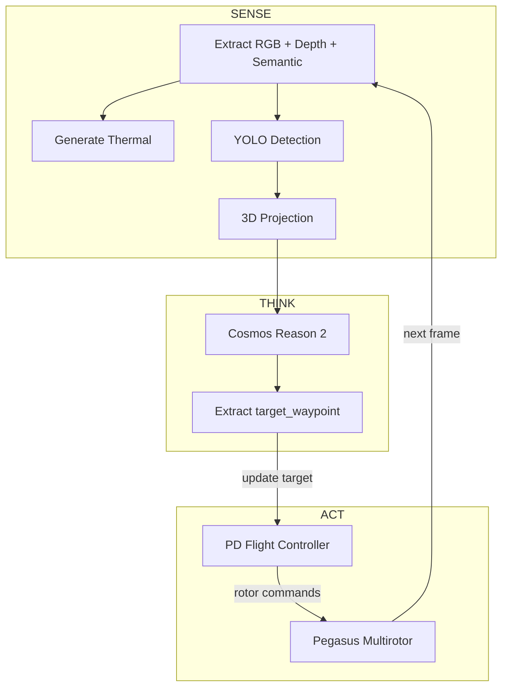
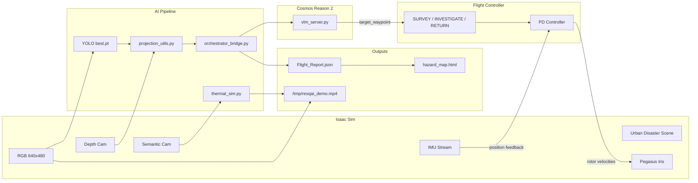

# ResQ-AI Full Demo Pipeline Plan

## Current State

**What works:**

- Scene geometry renders (689 prims: buildings, roads, vehicles, pedestrians, trees, disaster zones)
- HDRI sky dome light is applied
- Streaming server runs and is viewable via WebRTC client at `204.52.24.200`
- Semantic labels applied to all prims for thermal simulation
- All sim_bridge scripts exist: `generate_urban_scene.py`, `spawn_drone.py`, `thermal_sim.py`, `projection_utils.py`, `main_sim_loop.py`
- Orchestrator bridge exists: `orchestrator_bridge.py` wrapping YOLO + VLM pipeline
- Pegasus Simulator installed at `PegasusSimulator/`
- YOLO weights at `Phase1_SituationalAwareness/best.pt`
- `build_cosmos_prompt()` already asks Cosmos to respond with `{"waypoint": [x, y, z], "reasoning": "..."}`

**What is broken / missing:**

- OmniPBR materials render pink/red (MDL fix written but not regenerated yet)
- VLM mock server returns generic text, not the `{"waypoint": [...]}` JSON the prompt asks for
- `orchestrator_bridge.py` saves VLM `advice` text but never extracts the waypoint coordinate
- No closed-loop: drone would follow hardcoded rails, ignoring AI decisions
- No demo script, no video recording

---

## Phase 1: Fix Scene Materials (30 min)

The `_mat()` function in `generate_urban_scene.py` was updated to properly set MDL attributes (`info:implementationSource = "sourceAsset"`, `info:mdl:sourceAsset = @OmniPBR.mdl@`, `info:mdl:sourceAsset:subIdentifier = "OmniPBR"`) and connect all three MDL outputs (surface, displacement, volume). This matches the pattern in Isaac Sim's built-in `BuiltInMaterials.usda`.

**Action:** Regenerate the scene, reload in streaming viewer, confirm correct colors.

---

## Phase 2: Close the Loop — VLM + Orchestrator Upgrades (1 hr)

### 2a. Upgrade VLM Mock Server

`orchestrator/vlm_server.py` currently returns:

```python
{"status": "critical", "advice": "...", "hazard_details": "..."}
```

It must be upgraded to parse the incoming `context` JSON (which contains `observations` with `world_xyz` coordinates and `drone_state.position`), reason about priority, and return:

```json
{
  "status": "critical",
  "advice": "Fire detected at [54, -7.5, 1.0]. Prioritizing over collapsed building due to active threat.",
  "decision": "investigate",
  "target_waypoint": [54, -7.5, 18.0],
  "reasoning": "Vehicle fire is active and poses immediate danger. Approaching from 18m altitude for safe observation."
}
```

The mock logic should: pick the highest-priority hazard (fire > person > vehicle > building), compute a safe observation waypoint offset 15-20m above the hazard's `world_xyz`, and return it.

### 2b. Upgrade Orchestrator Bridge

`orchestrator/orchestrator_bridge.py` line 318 currently only extracts `advice`:

```python
entry["vlm_analysis"] = resp.get("advice", "")
```

Add extraction of the waypoint so `process_frame()` returns it:

```python
return {
    "hazards": hazards_3d,
    "cosmos_prompt": cosmos_prompt,
    "target_waypoint": latest_vlm_waypoint,   # NEW -- [x,y,z] or None
    "reasoning": latest_vlm_reasoning,          # NEW
}
```

---

## Phase 3: Autonomous Demo Flight Script (1-2 hrs)

Create `sim_bridge/demo_flight.py` — the master demo script — built around a **Sense-Think-Act** loop instead of hardcoded waypoints.

### Architecture




### Flight State Machine

The drone operates in three states:

- **SURVEY**: Initial state. Fly to a high-altitude survey position `[0, 0, 45]` and hover. Run YOLO each frame. Once Cosmos identifies a target, transition to INVESTIGATE.
- **INVESTIGATE**: Fly toward the `target_waypoint` returned by Cosmos. When within 5m of the waypoint, hover for ~3 seconds to collect detailed observations. Then ask Cosmos again for the next priority. If a new waypoint is given, update target. If no new hazards, transition to RETURN.
- **RETURN**: Fly back to the survey position. Mission complete.

### PD Controller

A simple position PD controller computes velocity commands from the error between current drone position (from `IMUStreamBackend`) and the current target waypoint:

```python
error = target_waypoint - current_position
velocity_cmd = Kp * error + Kd * (error - prev_error) / dt
```

The PD controller target is **dynamically updated** whenever Cosmos returns a new waypoint — this is the key difference from the old plan.

### Livestream + Follow Camera

Enable the `omni.services.livestream.nvcf` extension from within the script so the WebRTC client shows the flight in real time. Attach a chase-cam to the drone for cinematic viewing.

---

## Phase 4: Video Recording and Output Capture (1 hr)

Record the demo and capture all AI outputs:

1. **Video**: Use `cv2.VideoWriter` to save annotated frames at 30fps to `/tmp/resqai_demo.mp4`:
  - RGB frame from drone camera
  - YOLO bounding boxes with class labels and confidence
  - Thermal thumbnail in corner
  - Current state label (SURVEY / INVESTIGATE / RETURN)
  - Cosmos reasoning text + target waypoint arrow
  - Drone position + altitude HUD
2. **Flight Report JSON**: At mission end, save `Flight_Report.json` with:
  - Full flight path (position at each timestep)
  - All detected hazards with 3D world positions
  - Every Cosmos decision (waypoint + reasoning + timestamp)
  - Investigation durations per hazard
3. **Hazard Map**: Run `orchestrator/generate_map.py` on the flight report to produce an interactive Folium HTML map.
4. **Console Dashboard**: Live print during flight:
  - `[SURVEY] alt=45.0m | detections=0 | scanning...`
  - `[INVESTIGATE] target=[54, -7.5, 18] | dist=12.3m | hazard=fire`
  - `[COSMOS] "Vehicle fire is active, approaching from safe altitude"`

---

## Phase 5: VLM Server (30 min)

- **For demo**: Run the upgraded mock `vlm_server.py` which returns structured waypoints based on hazard priority logic.
- **For production**: Swap the URL to a real Cosmos Reason 2 endpoint. The `orchestrator_bridge.py` already sends the correct JSON schema and handles async responses. The prompt instruction already asks for `{"waypoint": [x, y, z], "reasoning": "..."}`.

---

## Complete Data Flow




---

## Execution Order

- Step 1: Regenerate scene with fixed materials (already coded, just needs to run)
- Step 2: Verify scene renders correctly in streaming viewer
- Step 3: Upgrade `vlm_server.py` to return structured waypoints
- Step 4: Upgrade `orchestrator_bridge.py` to extract and return waypoints
- Step 5: Create `demo_flight.py` with Sense-Think-Act loop + PD controller
- Step 6: Test drone spawn + basic autonomous flight
- Step 7: Add video recording + annotated frame overlay
- Step 8: Run full end-to-end demo, collect all outputs

